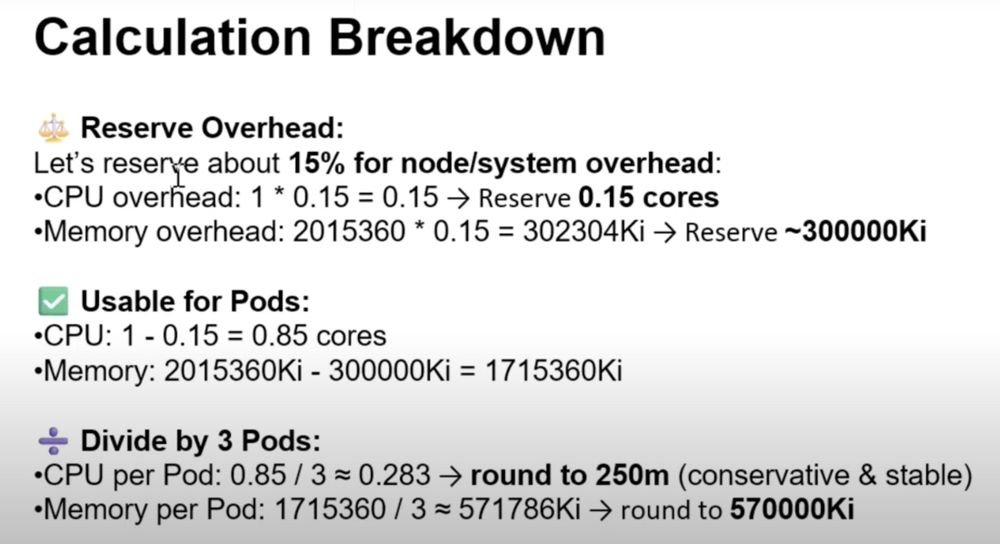

## Setup Configuration 

### Create a namespace and deploy the app

`wordpress-setup.yaml`
```bash
apiVersion: v1
kind: Namespace
metadata:
  name: relative-fawn
---
apiVersion: apps/v1
kind: Deployment
metadata:
  name: wordpress
  namespace: relative-fawn
spec:
  replicas: 3
  selector:
    matchLabels:
      app: wordpress
  template:
    metadata:
      labels:
        app: wordpress
    spec:
      initContainers:
        - name: init-db
          image: busybox
          command: ["sh", "-c", "echo init; sleep 3600"]
      containers:
        - name: wordpress
          image: wordpress:php8.0-apache
          ports:
            - containerPort: 80
```

```bash
kubectl apply -f wordpress-setup.yaml 
namespace/relative-fawn created
deployment.apps/wordpress created
```

### Important Notes for this sceniro (formula)



## Solution Setup

### Scale down to 0 for wordpress deployment

```bash
kubectl scale deployment.apps/wordpress -n relative-fawn --replicas=0
deployment.apps/wordpress scaled
```

```bash
kubectl edit deployment wordpress -n relative-fawn

## Add this resource requests in both init containers and application containers
          resources:
            requests: 
              memory: "570000Ki" or "558Mi" 
              cpu: "250m"
```

### Scale back to normal 3 replicas pods after configuring with resource limit

```bash
kubectl scale deployment.apps/wordpress -n relative-fawn --replicas=3
deployment.apps/wordpress scaled
```

```bash
kubectl get pods -n relative-fawn

NAME                             READY   STATUS    RESTARTS   AGE
pod/wordpress-7d8fbf4dfb-98sff   1/1     Running   0          3m22s
pod/wordpress-7d8fbf4dfb-lhsjt   1/1     Running   0          3m22s
pod/wordpress-7d8fbf4dfb-nmmq5   1/1     Running   0          3m22s

NAME                        READY   UP-TO-DATE   AVAILABLE   AGE
deployment.apps/wordpress   3/3     3            3           17m

NAME                                   DESIRED   CURRENT   READY   AGE
replicaset.apps/wordpress-77b74f6999   0         0         0       17m
replicaset.apps/wordpress-7d8fbf4dfb   3         3         3       3m25s
```

## Important Notes 

### **15% Overhead Reservation Strategy**
```
Reserve = Total × 0.15
Usable = Total - Reserved  
Per Pod = Usable ÷ Pod Count
```

## Calculation Verification

### **Scenario 1: Small Node**
```
Given: CPU=1, Memory=2015360ki, Pods=3

CPU Calculation:
- Reserved: 1 × 0.15 = 0.15
- Usable: 1 - 0.15 = 0.85
- Per pod: 0.85 ÷ 3 = 0.283 → 250m ✓

Memory Calculation:  
- Reserved: 2015360 × 0.15 = 302304ki
- Usable: 2015360 - 302304 = 1713056ki
- Per pod: 1713056 ÷ 3 = 571018ki → 570Mi ✓
```

### **Scenario 2: Larger Node**
```
Given: CPU=4, Memory=4000000ki, Pods=3

CPU Calculation:
- Reserved: 4 × 0.15 = 0.6  
- Usable: 4 - 0.6 = 3.4
- Per pod: 3.4 ÷ 3 = 1.133 → 1100m ✓

Memory Calculation:
- Reserved: 4000000 × 0.15 = 600000ki
- Usable: 4000000 - 600000 = 3400000ki  
- Per pod: 3400000 ÷ 3 = 1133333ki → 1103Mi ✓
```